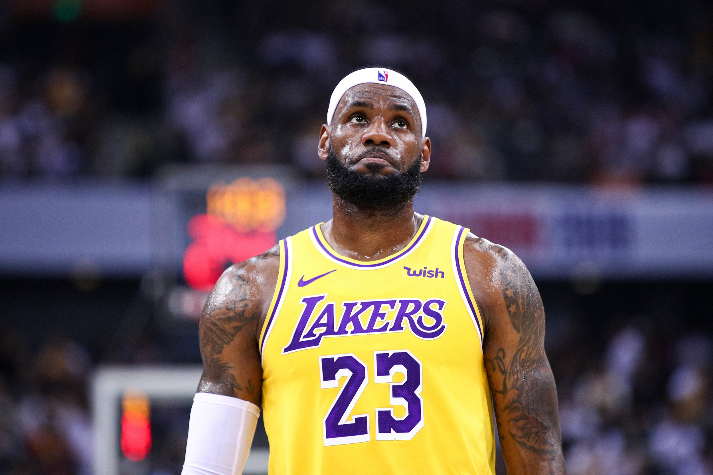
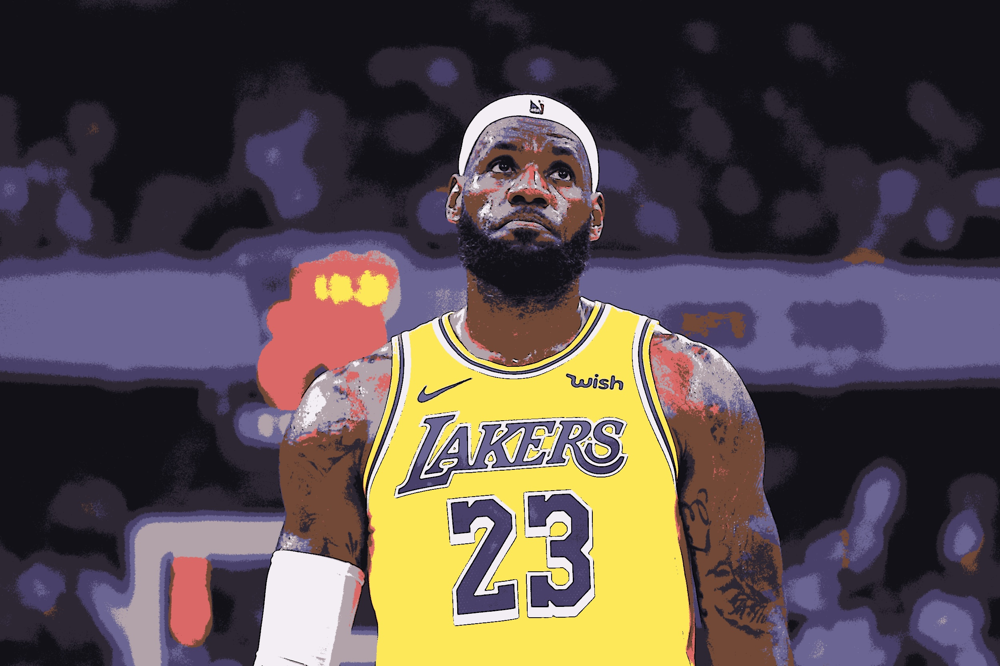
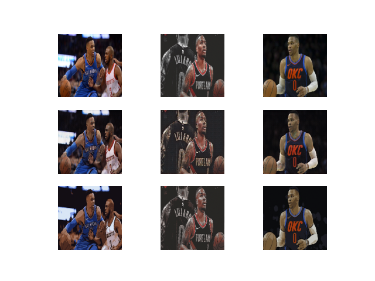

#  Cartoonization with GANs**


## Overview

This project focuses on transforming real images into cartoon-style images using a two-part process. The first part utilizes OpenCV to preprocess and generate cartoonized versions of input images. The second part trains a Generative Adversarial Network (GAN) to refine and enhance the cartoon images, producing more accurate and high-quality results.

## Table of Contents

1. [Introduction](#introduction)
2. [Requirements](#requirements)
3. [Installation](#installation)
4. [Usage](#usage)
5. [Project Structure](#project-structure)
6. [Results](#results)
7. [Contributing](#contributing)
8. [License](#license)

## Introduction

This project aims to create a cartoonization pipeline that first applies image transformations using OpenCV and then refines the results using a GAN model. By combining traditional computer vision techniques with modern deep learning, the goal is to generate realistic cartoon-style images.

## Requirements

* Python 3.x
* OpenCV
* TensorFlow or PyTorch (for GAN model training)
* NumPy
* Matplotlib
* Other necessary libraries as mentioned in the `requirements.txt` file.

## Installation

### Clone the Repository

```bash
git clone https://github.com/username/cartoonization-gan.git
cd cartoonization-gan
```

### Install Required Dependencies

```bash
pip install -r requirements.txt
```

## Usage

### Part 1: Cartoonization with OpenCV

The first part of the project involves applying image transformations to make the image look like a cartoon using OpenCV. To perform the cartoonization on a single image, use the following script:

```bash
python Img_cartoonizer.py 
```

This script will apply filters like edge detection and color quantization to create a cartoon-style image.

### Part 2: Training the GAN Model

To train the GAN model using the cartoonized images, use the following steps:

1. Prepare a dataset of cartoonized images generated by OpenCV.
2. Train the GAN model
3. The model will save its progress at regular intervals. To generate new cartoon images, use the trained model by running:

```bash
model-train.ipynb
```

## Project Structure

* `Img_cartoonizer.py` or `Img_cartoonizer.ipynb`: Script to apply cartoonization filters using OpenCV.
* `model-train.ipynb`: Script to train the GAN model on cartoonized images and to generate cartoon images using a trained GAN model.
* `models/`: Directory containing GAN architecture and pre-trained weights.
* `train/`: Directory for storing input images (real/) and output images (cartoon).
* `requirements.txt`: List of required Python packages for the project.
* `source_dataset.txt`: List of dataset that coulb be used

## Results

### Example 1

* Input Image: 
* Cartoonized Output: ]

### Example 2

[]

## Contributing

We welcome contributions to improve the quality and features of this project. Please fork the repository and create a pull request with your changes.## License

This project is licensed under the MIT License - see the [LICENSE](LICENSE) file for details.

### Acknowledgments

* This project uses OpenCV for image processing and GAN models for image refinement.
* The GAN architecture is based on the [DCGAN](https://arxiv.org/abs/1511.06434) paper.
* The project structure and documentation are inspired by:
  * [TensorFlow Project Template](https://github.com/tensorflow/template)
  * [Manchine learning Mastery](https://machinelearningmastery.com/how-to-develop-a-pix2pix-gan-for-image-to-image-translation/)
